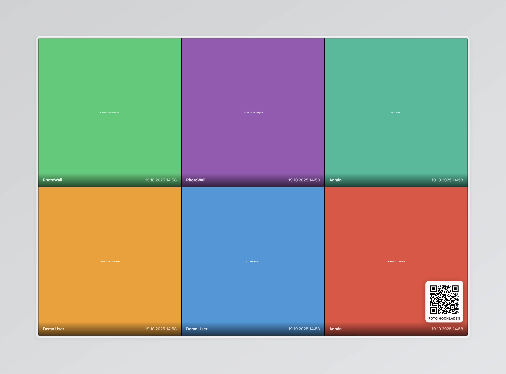
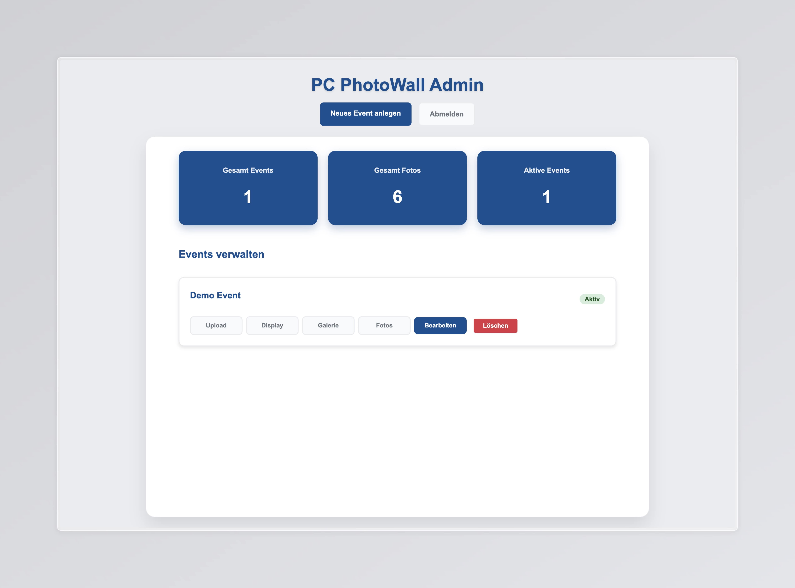
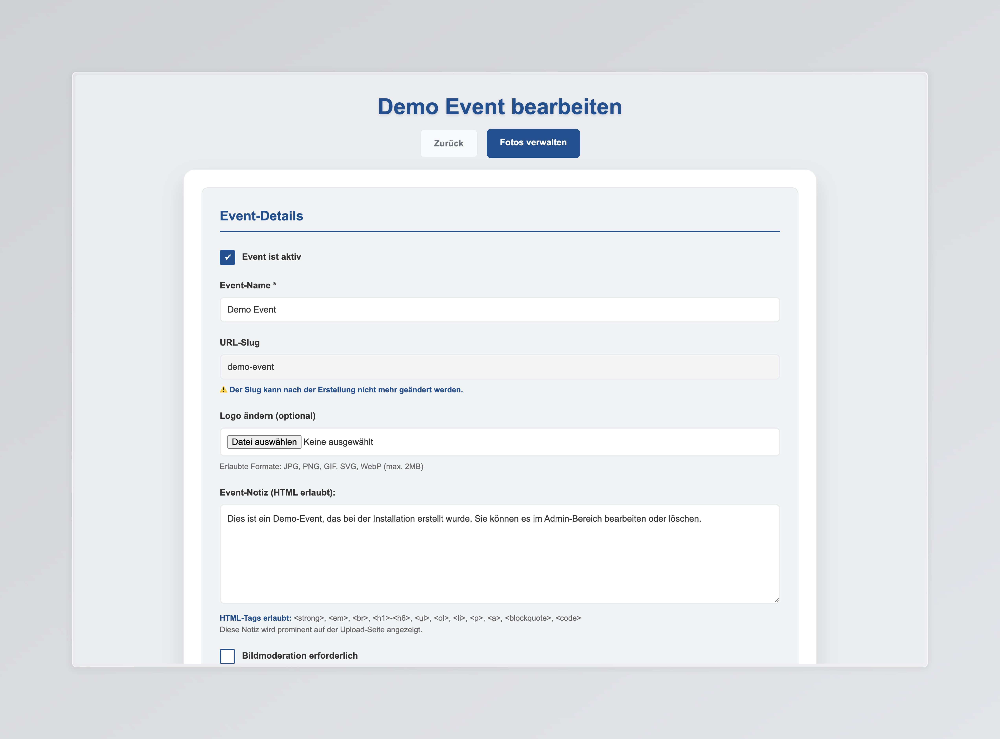
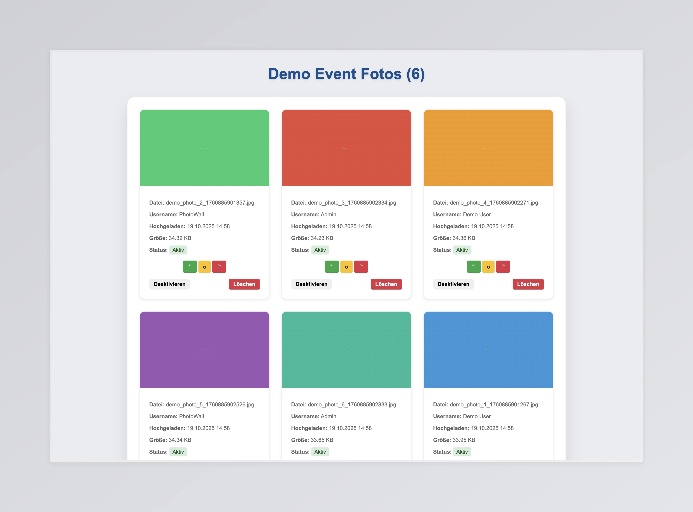
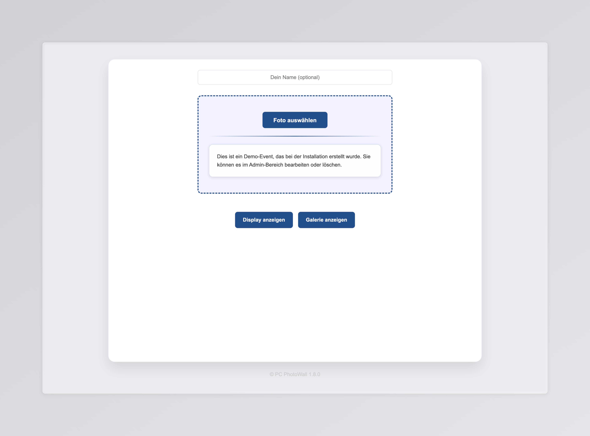
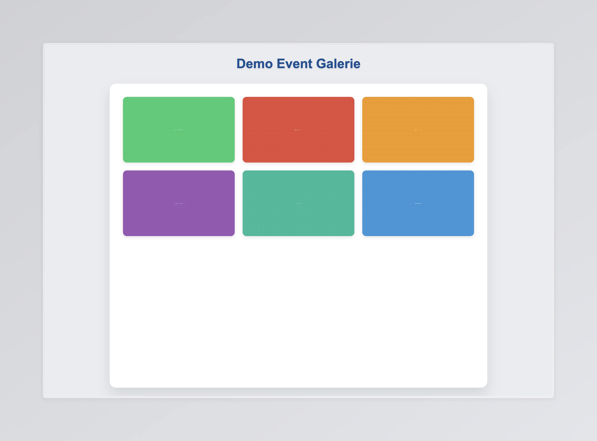

# 📸 PC PhotoWall

[](CHANGELOG.md)
[](LICENSE)
[](https://www.php.net/)
[](https://www.docker.com/)
[](tests/)

---

## ✨ Features

- 📱 **Event-basierter Upload** - Nutzer laden Fotos zu spezifischen Events hoch
- 🌍 **GPS-Validierung** - Optional: Nur Fotos vom Event-Ort zulassen
- 🖼️ **Live-Display** - Automatische Slideshow mit konfigurierbaren Modi
- 🎨 **Galerie-Ansicht** - Responsive Grid-Layout für alle Geräte
- ✅ **Foto-Moderation** - Optional: Manuelle Freigabe von Uploads
- 🔄 **Duplikat-Erkennung** - Automatisch via SHA-256 Hash
- 📐 **Auto-Rotation** - EXIF-basierte Bildausrichtung
- 🔗 **QR-Codes** - Automatische QR-Code-Generierung pro Event
- 🎯 **Multi-Format** - JPEG, PNG, GIF, WebP, HEIC/HEIF

---

## 📋 Inhaltsverzeichnis

- [Übersicht](#-features)
- [Quick Start](#-quick-start)
- [Screenshots](#-screenshots)
- [Featuredetails](#-featuredetails)
- [Konfiguration](#-konfiguration)
- [Verwendung](#-verwendung)
- [Display Modi](#-display-modi)
- [Backup & Restore](#-backup--restore)
- [Make-Befehle](#️-make-befehle)
- [Troubleshooting](#-troubleshooting)
- [Lizenz](#-lizenz)

---

## 🚀 Quick Start

### Für schnelles Ausprobieren (Development)

```bash
# 1. Repository klonen
git clone https://github.com/proudcommerce/pcphotowall.git
cd pcphotowall

# 2. Environment Setup
make setup

# 3. Development-Umgebung starten
make dev-up

# Warten bis Container bereit sind (ca. 30 Sekunden)
# Demo-Event wird automatisch erstellt

# 4. Öffnen
# App:         http://localhost:4000
# Admin:       http://localhost:4000/admin/
# phpMyAdmin:  http://localhost:8081
# Demo-Event:  http://localhost:4000/demo-event
```

**Standard-Zugangsdaten:**

- Admin-Passwort: Siehe `.env` (ADMIN_PASSWORD)
- phpMyAdmin: photowall / photowall

### Für Production

```bash

# 1. Repository klonen
git clone https://github.com/proudcommerce/pcphotowall.git
cd pcphotowall

# 2. Environment Setup
make setup

# 3. .env für Production konfigurieren
nano .env
# Setze APP_ENV=production
# Ändere alle Passwörter!
# Setze APP_URL auf deine Domain

# 3. Production starten
make prod-up

# 4. Logs überwachen
make prod-logs
```

---

## 📸 Screenshots

### Display-Ansicht

<details>
<summary>Live-Display mit Grid-Layout</summary>


*Live-Display mit 6 Fotos im Grid-Layout mit Overlays und QR-Code*
</details>

### Admin-Bereich

<details>
<summary>Admin-Übersicht</summary>


*Admin-Dashboard mit Event-Statistiken und Verwaltung*
</details>

<details>
<summary>Event bearbeiten</summary>


*Event-Konfiguration mit allen Einstellungen*
</details>

<details>
<summary>Foto-Verwaltung</summary>


*Foto-Moderation mit Status-Anzeige und Rotation*
</details>

### Upload & Galerie

<details>
<summary>Upload-Seite</summary>


*Upload-Interface mit Drag & Drop und Event-Notiz*
</details>

<details>
<summary>Galerie-Ansicht</summary>


*Responsive Grid-Layout der Foto-Galerie*
</details>

---

## ✨ Featuredetails

### 📱 Event-basierter Upload

Jedes Event erhält einen eindeutigen Slug und optional einen QR-Code:

- **URL-basiert**: `https://your-domain.com/[event-slug]`
- **QR-Code**: Automatisch generiert für schnellen Zugang
- **Multi-Upload**: Mehrere Fotos gleichzeitig hochladen
- **Format-Support**: JPEG, PNG, GIF, WebP, HEIC/HEIF
- **Duplikat-Erkennung**: SHA-256 Hash verhindert doppelte Uploads
- **Auto-Rotation**: EXIF-basierte Bildausrichtung

### 🌍 GPS-Validierung

Optional kann ein Event GPS-Koordinaten und einen Radius definieren:

- **Radius-Check**: Fotos müssen innerhalb des definierten Radius aufgenommen sein
- **Flexible Konfiguration**: 10m bis 10km Radius einstellbar
- **Fallback-Moderation**: Fotos ohne GPS-Daten gehen automatisch in Moderation
- **Haversine-Formel**: Präzise Distanzberechnung

### 🖼️ Live-Display

Verschiedene Anzeigemodi für unterschiedliche Event-Typen:

**Display-Modi:**

- **Random** - Zufällige Anzeige aller Fotos
- **Newest** - Neueste Fotos zuerst
- **Chronological** - Zeitlich sortiert

**Layout-Optionen:**

- **Single** - Ein großes Foto im Vollbild
- **Grid** - Mehrere Fotos gleichzeitig (1-10 Fotos)
- **Anpassbare Spalten** - 2-4 Spalten im Grid-Layout

**Overlay-Einstellungen:**

- Benutzername anzeigen/verstecken
- Datum anzeigen/verstecken
- Transparenz konfigurierbar (0-100%)
- Logo-Integration möglich

**URL-Parameter** zur Laufzeit-Konfiguration:

```
/[event-slug]/display?display_count=9&display_mode=newest&display_interval=5&show_logo=1
```

### 🎨 Galerie-Ansicht

Responsive Grid-Layout für alle hochgeladenen Fotos:

- **Masonry-Layout** - Automatische Anordnung
- **Thumbnail-Ansicht** - Schnelle Ladezeiten
- **Lightbox** - Vollbild-Ansicht per Klick
- **Mobile-optimiert** - Touch-Gesten Support
- **Lazy Loading** - Nur sichtbare Bilder laden

### ✅ Foto-Moderation

Optionale manuelle Freigabe von Uploads:

- **Pending-Status** - Neue Uploads sind zunächst inaktiv
- **Admin-Interface** - Einfache Approve/Reject Buttons
- **Batch-Operations** - Mehrere Fotos gleichzeitig bearbeiten
- **Manuelle Rotation** - Fotos direkt im Admin-Panel drehen (90°, 180°, 270°)
- **GPS-Fallback** - Fotos ohne GPS-Daten gehen automatisch in Moderation
- **Vorschau** - Thumbnails für schnelle Entscheidungen

### 🔒 Upload-Kontrolle

Flexible Steuerung der Upload-Funktion pro Event:

- **Upload aktivieren/deaktivieren** - Schalter im Admin-Panel
- **Event beendet** - Uploads nachträglich deaktivieren
- **Temporäre Sperre** - Upload-Funktion vorübergehend pausieren
- **Benutzerfreundlich** - Klare Meldung bei deaktiviertem Upload
- **Sofortige Wirkung** - Keine Cache-Verzögerung

### 🔄 Automatische Bildverarbeitung

Intelligente Verarbeitung aller Uploads:

1. **Upload-Validierung** - Typ, Größe, Format prüfen
2. **HEIC/HEIF Konvertierung** - Automatisch zu JPEG (ImageMagick)
3. **Auto-Rotation** - EXIF-Orientierung korrigieren
4. **Größenanpassung** - Auf maximale Breite/Höhe skalieren
5. **Thumbnail-Generierung** - Optimierte Vorschaubilder (300x300px)
6. **Hash-Berechnung** - SHA-256 für Duplikat-Erkennung
7. **Database-Insert** - Metadata speichern

### 🔐 Sicherheit

Enterprise-Grade Sicherheitsfeatures:

- **CSRF-Protection** - Token-basierte Formular-Validierung
- **Session-Management** - Sichere Admin-Sessions
- **Input-Sanitization** - XSS-Schutz durch htmlspecialchars
- **File-Type-Validation** - MIME-Type-Prüfung
- **SQL-Injection-Prevention** - PDO Prepared Statements
- **Exception-Handling** - Custom Exception-Hierarchie

---

## ⚙️ Konfiguration

### Environment Variables (.env)

Alle 28 konfigurierbaren Parameter im Überblick:

#### Database Configuration

```bash
DB_HOST=db                    # Docker: 'db', lokal: 'localhost'
DB_NAME=photowall             # Datenbankname
DB_USER=photowall             # DB-Benutzer
DB_PASS=photowall             # DB-Passwort (ÄNDERN!)
```

#### App Configuration

```bash
APP_NAME=PC PhotoWall         # Anzeigename der App
APP_URL=http://localhost:4000 # Basis-URL (mit https:// für Production)
APP_ENV=development           # development|production
```

#### Upload Configuration

```bash
UPLOAD_ALLOWED_TYPES=image/jpeg,image/png,image/gif,image/webp,image/heic,image/heif
DEFAULT_MAX_UPLOAD_SIZE=10485760  # 10MB in bytes
MAX_EXECUTION_TIME=300            # PHP max_execution_time (Sekunden)
MEMORY_LIMIT=256M                 # PHP memory_limit
```

#### Image Processing

```bash
IMAGE_MAX_WIDTH=1920          # Maximale Bildbreite (px)
IMAGE_MAX_HEIGHT=1080         # Maximale Bildhöhe (px)
IMAGE_QUALITY_HIGH=90         # JPEG-Qualität (0-100)
IMAGE_QUALITY_MEDIUM=85       # JPEG-Qualität Medium
THUMBNAIL_MAX_WIDTH=300       # Thumbnail-Breite (px)
THUMBNAIL_MAX_HEIGHT=300      # Thumbnail-Höhe (px)
THUMBNAIL_QUALITY=85          # Thumbnail-JPEG-Qualität
```

#### Display Defaults

```bash
DEFAULT_DISPLAY_COUNT=9       # Anzahl Fotos im Grid (1-10)
DEFAULT_DISPLAY_INTERVAL=5    # Sekunden zwischen Fotowechsel
DEFAULT_DISPLAY_MODE=random   # random|newest|chronological
DEFAULT_GRID_COLUMNS=3        # Spalten im Grid-Layout (2-4)
```

#### GPS Configuration

```bash
GPS_DEFAULT_RADIUS_METERS=100 # Standard-Radius für GPS-Check (m)
DISTANCE_KM_THRESHOLD=1000    # Max. Distanz für Warnings (km)
```

#### QR Code Configuration

```bash
QR_CODE_DEFAULT_SIZE=200      # QR-Code-Größe (px)
QR_CODE_MARGIN=10             # QR-Code-Rand (px)
```

#### Security Configuration

```bash
ADMIN_PASSWORD=ChangeThisSecurePassword123!  # ÄNDERN!
SESSION_TIMEOUT=3600          # Session-Timeout (Sekunden)
CSRF_TOKEN_NAME=csrf_token    # Name des CSRF-Tokens
```

#### Logging Configuration

```bash
LOG_ERRORS=1                  # Fehler loggen (0|1)
DISPLAY_ERRORS=0              # Fehler anzeigen (nur Development: 1)
```
---

## 📖 Verwendung

### Für Event-Teilnehmer (Upload)

1. **URL aufrufen oder QR-Code scannen**
   - z.B. `https://your-domain.com/hochzeit-max-anna`
   - QR-Code vom Veranstalter erhalten

2. **Optional: Name eingeben**
   - Wird bei Foto-Anzeige eingeblendet

3. **Foto(s) auswählen**
   - Einzeln oder mehrere gleichzeitig
   - Direkt von Kamera oder aus Galerie

4. **Hochladen**
   - Progress-Bar zeigt Upload-Status
   - GPS wird automatisch geprüft (falls aktiviert)

5. **Bestätigung**
   - Erfolgsmeldung bei Approval
   - Hinweis bei Moderation-Queue

### Für Event-Veranstalter (Admin)

#### Event erstellen

1. Admin-Login: `https://your-domain.com/admin/`
2. "Neues Event erstellen"
3. **Basis-Einstellungen:**
   - Event-Name (z.B. "Hochzeit Max & Anna")
   - Slug wird automatisch generiert (kann bearbeitet werden)

4. **GPS-Validierung (optional):**
   - Breite/Länge eingeben (z.B. von Google Maps)
   - Radius in Metern (empfohlen: 100-500m)
   - "GPS-Validierung aktivieren" anhaken

5. **Display-Einstellungen:**
   - Anzeigemodus (Random/Newest/Chronological)
   - Anzahl Fotos (1-10)
   - Wechselintervall (Sekunden)
   - Grid-Spalten (2-4)

6. **Upload-Einstellungen:**
   - Maximale Upload-Größe (1-50MB)

7. **Feature-Toggles:**
   - Logo anzeigen
   - QR-Code anzeigen
   - Display-Link anzeigen
   - Galerie-Link anzeigen
   - Foto-Moderation aktivieren
   - Upload aktivieren/deaktivieren

8. **Speichern**
   - Event ist sofort verfügbar
   - QR-Code wird generiert

#### Event bearbeiten

1. Event-Liste aufrufen
2. "Bearbeiten" bei gewünschtem Event
3. Einstellungen anpassen
4. Speichern

#### Fotos moderieren (wenn aktiviert)

1. Event-Liste → "Fotos verwalten"
2. **Foto-Status:**
   - 🔴 Rot = Pending (wartet auf Freigabe)
   - 🟢 Grün = Aktiv (wird angezeigt)

3. **Aktionen:**
   - "Freigeben" - Foto aktivieren
   - "Deaktivieren" - Foto verstecken
   - "Drehen" - Manuelle Rotation (90°, 180°, 270°)

4. **Batch-Operationen:**
   - Mehrere Fotos gleichzeitig freigeben

---

## 📊 Display Modi

### Random Mode (Zufällig)

**Best für:** Lange Events, viele Fotos, abwechslungsreich

```
Konfiguration:
- display_mode: random
- display_count: 9 (empfohlen)
- display_interval: 5-10 Sekunden
```

**Verhalten:**

- Zufällige Auswahl aus allen aktiven Fotos
- Keine Dopplungen innerhalb kurzer Zeit
- Kontinuierliche Aktualisierung

### Newest Mode (Neueste zuerst)

**Best für:** Live-Events, aktives Feedback, Social-Media-Feeling

```
Konfiguration:
- display_mode: newest
- display_count: 1-4 (empfohlen)
- display_interval: 3-5 Sekunden
```

**Verhalten:**

- Neueste Uploads erscheinen sofort
- Ältere Fotos werden verdrängt
- Dynamische Aktualisierung

### Chronological Mode (Zeitlich sortiert)

**Best für:** Story-Telling, Event-Nachbereitung, Chronologie zeigen

```
Konfiguration:
- display_mode: chronological
- display_count: 1 (empfohlen)
- display_interval: 5-10 Sekunden
```

**Verhalten:**

- Fotos in Upload-Reihenfolge
- Zeigt Event-Verlauf
- Von alt nach neu

### URL-Parameter Override

Display-Einstellungen zur Laufzeit überschreiben:

```bash
# Vollständiges Beispiel
/hochzeit-max-anna/display?display_count=6&display_mode=newest&display_interval=3&show_logo=1

# Einzelne Parameter
?display_count=4          # Anzahl Fotos
?display_mode=newest      # Modus
?display_interval=10      # Intervall
?show_logo=1              # Logo anzeigen (0|1)
```

---

## 💾 Backup & Restore

### Backup erstellen

**Einzelnes Event sichern:**

```bash
# Via Event-Slug
make backup hochzeit-max-anna

# Oder mit EVENT-Variable
make backup EVENT=hochzeit-max-anna
```

**Alle Events sichern:**

```bash
make backup-all
```

**Backup-Inhalt:**

- Event-Fotos (Originale + Thumbnails)
- Event-Logo (falls vorhanden)
- Datenbank-Dump (Event + Fotos)
- Metadata (Timestamp, Slug, Hash)

**Backup-Format:**

```
backups/picturewall_backup_[event-slug]_[YYYYMMDD_HHMMSS].tar.gz
```

**Hinweis:** Backup-Dateien verwenden das Präfix `picturewall_backup_` aus historischen Gründen.

### Backups auflisten

```bash
make list-backups

# Output:
# Verfügbare Backups:
#   backups/picturewall_backup_demo-event_20250115_143022.tar.gz (2.5M) - Jan 15 14:30
#   backups/picturewall_backup_hochzeit_20250114_120000.tar.gz (125M) - Jan 14 12:00
```

### Backup wiederherstellen

**Vollständiges Restore (Datenbank + Fotos):**

```bash
# Via Pfad-Argument
make restore backups/picturewall_backup_demo-event_20250115_143022.tar.gz

# Oder mit FILE-Variable
make restore FILE=backups/picturewall_backup_demo-event_20250115_143022.tar.gz
```

**Nur Datenbank wiederherstellen (ohne Fotos):**

```bash
# Via Pfad-Argument
make restore-db backups/picturewall_backup_demo-event_20250115_143022.tar.gz

# Oder mit FILE-Variable
make restore-db FILE=backups/picturewall_backup_demo-event_20250115_143022.tar.gz
```

---

## 🛠️ Make-Befehle

Alle verfügbaren Befehle zur Verwaltung der Anwendung:

### Setup & Build

```bash
make clean              # Vollständiger Reset: Dev + Prod Container, Netzwerke, Volumes + Upload-Daten löschen
make setup              # Initiales Setup (.env.example nach .env kopieren)
```

### Development (mit phpMyAdmin)

```bash
make dev-up             # Entwicklungsumgebung mit phpMyAdmin starten
make dev-down           # Entwicklungsumgebung stoppen
make dev-restart        # Entwicklungsumgebung neustarten
make dev-logs           # Logs der Entwicklungs-Services anzeigen
make dev-status         # Status der Entwicklungs-Container anzeigen
```

### Production

```bash
make prod-up            # Produktionsumgebung starten
make prod-down          # Produktionsumgebung stoppen
make prod-restart       # Produktionsumgebung neustarten
make prod-logs          # Logs aller Produktions-Services anzeigen
make prod-status        # Status der Produktions-Container anzeigen
```

### Testing

```bash
make test               # Alle Tests ausführen
make test-quick         # Schnelltests (ohne Integration/Real Images)
make test-syntax        # PHP-Syntax-Prüfung
```

### Backup & Restore

```bash
make backup [slug]      # Spezifisches Event sichern (Bilder + Datenbank)
make backup-all         # Alle Events und komplette Datenbank sichern
make restore [pfad]     # Aus Backup-Datei wiederherstellen (Bilder + DB)
make restore-db [pfad]  # Nur Datenbank aus Backup wiederherstellen
make list-backups       # Alle verfügbaren Backups auflisten
```

**Tipp:** `make help` oder einfach `make` zeigt diese Übersicht auch im Terminal an.

---

## 🔧 Troubleshooting

### Container starten nicht

**Problem:** `make dev-up` schlägt fehl

**Lösung:**

```bash
# Ports prüfen
netstat -tulpn | grep -E '4000|3306|8081'

# Falls Ports belegt: In docker-compose.dev.yml anpassen
# Oder andere Services stoppen

# Docker-Status prüfen
systemctl status docker

# Logs anschauen
docker-compose -f docker-compose.dev.yml logs
```

### Uploads schlagen fehl

**Problem:** "Upload failed" Fehler

**Mögliche Ursachen:**

1. **File-Permissions:**

```bash
# Verzeichnisse prüfen
ls -la app/uploads/

# Permissions fixen
chmod -R 755 app/uploads/
chmod -R 755 app/data/
```

2. **PHP Upload-Limits:**

```bash
# In .env erhöhen
DEFAULT_MAX_UPLOAD_SIZE=52428800  # 50MB
MEMORY_LIMIT=512M
MAX_EXECUTION_TIME=600
```

3. **Disk-Space:**

```bash
df -h
# Alte Backups löschen wenn nötig
```

### GPS-Validierung funktioniert nicht

**Problem:** Fotos werden trotz korrekter GPS-Daten abgelehnt

**Debug:**

```bash
# Logs prüfen
tail -f app/logs/php_errors.log

# GPS-Koordinaten im Browser-Console prüfen
# Bei Upload sollte console.log die Koordinaten zeigen

# Radius erhöhen (in Admin → Event bearbeiten)
# Testweise: 1000m oder GPS-Validierung deaktivieren
```

### Display zeigt keine Fotos

**Problem:** Display-Seite bleibt leer

**Checkliste:**

1. **Fotos vorhanden?**

```bash
# Prüfen ob Fotos in Event-Verzeichnis
ls -la app/uploads/[event-slug]/photos/
```

2. **Fotos aktiv?**

```sql
-- In phpMyAdmin oder mysql
SELECT id, filename, is_active FROM photos WHERE event_id = X;
-- is_active muss 1 sein
```

3. **Browser-Console prüfen:**

```javascript
// F12 → Console
// Fehler bei API-Aufruf?
```

4. **Cache leeren:**

```bash
# Browser: Strg+Shift+R
# Oder im Inkognito-Modus testen
```

### phpMyAdmin nicht erreichbar

**Problem:** <http://localhost:8081> lädt nicht

**Lösung:**

```bash
# Nur in Development verfügbar!
# Production-Compose hat kein phpMyAdmin

# Container-Status prüfen
docker ps | grep phpmyadmin

# Falls nicht gestartet:
make dev-down
make dev-up

# Port belegt?
netstat -tulpn | grep 8081
```

### Thumbnails fehlen

**Problem:** Galerie zeigt keine Vorschaubilder

**Lösung:**

```bash
# GD-Extension prüfen
docker exec pcphotowall_web php -m | grep -i gd

# ImageMagick prüfen
docker exec pcphotowall_web convert --version

# Thumbnails manuell regenerieren (TODO: Script erstellen)
# Workaround: Fotos neu hochladen
```

### Database-Connection failed

**Problem:** "Database connection failed"

**Lösung:**

```bash
# Container laufen?
docker ps

# DB-Logs prüfen
docker logs pcphotowall_db

# Connection testen
docker exec pcphotowall_db mysql -uphotowall -pphotowall -e "SHOW DATABASES;"

# .env prüfen
cat .env | grep DB_

# Container neustarten
make dev-restart
```
---

## 📄 Lizenz

Dieses Projekt ist lizenziert unter der **GNU Affero General Public License v3.0 (AGPL-3.0)**.

### Was bedeutet das?

- ✅ **Freie Nutzung** - Sie können die Software frei verwenden, modifizieren und verteilen
- ✅ **Open Source** - Der Quellcode bleibt immer verfügbar
- ✅ **SaaS-geschützt** - Auch bei Web-Service-Betrieb muss der Code offengelegt werden
- ⚠️ **Copyleft** - Änderungen müssen unter derselben Lizenz veröffentlicht werden
- ⚠️ **Netzwerk-Nutzung** - Bei SaaS-Betrieb muss ein Link zum Quellcode bereitgestellt werden

Für **Closed-Source** oder **proprietäre** Nutzung ist eine separate kommerzielle Lizenz erforderlich.

Siehe [LICENSE](LICENSE) für den vollständigen Lizenztext.

---

Mit ❤️ entwickelt für das [DevOps Camp](https://devops-camp.de).

© [Proud Commerce](https://www.proudcommerce.com) | 2025